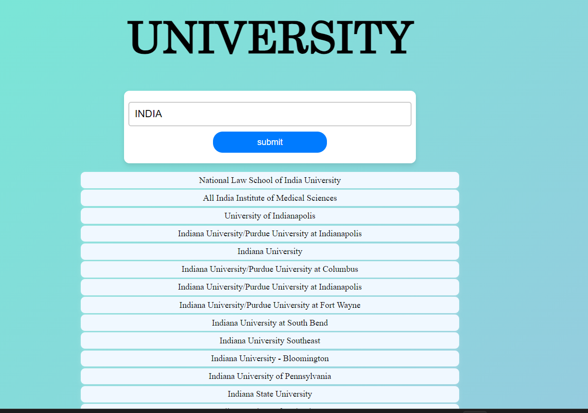

# Top Universities Around the World

This project highlights the leading universities in various countries globally. It utilizes an API to fetch data on top universities and presents it in a responsive web interface using Axios for API requests.

## Features

- Displays top universities from different countries
- Responsive design for optimal viewing on various devices
- Utilizes an API for up-to-date information
- Axios for handling API requests

## Getting Started

### Usage

1. Clone the repository:
   git clone https://github.com/Anakvyas/Top-Universities-Around-the-World.git
2. Navigate to the project directory and open index.html in your browser to view the project.

3. Enter a country name in the input field and click the submit button to fetch and display the top universities in that country.

## Screenshot

## Contributing

Contributions are welcome! Here are a few ways you can contribute:

- Enhance the user interface.
- Add new features.
- Fix bugs and optimize code.

